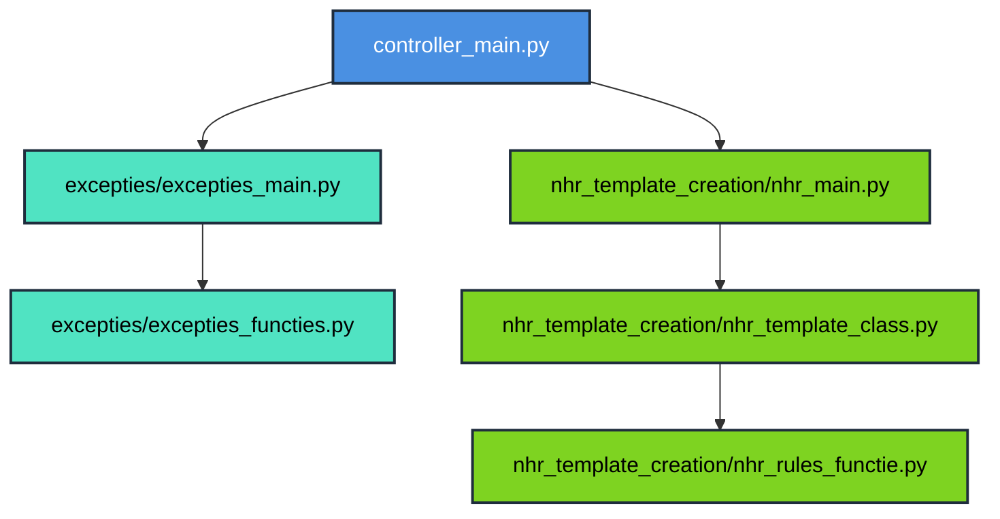

# Automatisering excepties extrahering uit NHR data en preparatie van NHR data 

Middels dit project kunnen er twee bewerkingen worden gedaan in een gekozen Excelbestand: checken en extraheren van excepties (-1 waarden) en 
het toepassen van rules die belangrijk zijn voor de correcte aanlevering van data aan de NHR.

## Project Structuur

    nhr_excepties/
    │
    ├── controller_main.py            
    ├── copy_files.py                
    │
    ├── excepties/                    
    │   ├── extract_exceptions.py
    │   ├── process_rules.py
    │   └── ...
    │
    ├── nhr_template_creation/       
    │   ├── create_template.py
    │   └── ...
    │
    ├── config/                     
    │   ├── rules_config.json
    │   └── ...
    │
    ├── data/
    │   ├── input/                   
    │   ├── output/                
    │   └── ...
    │
    ├── requirements.txt
    └── README.md

---

## End-to-End flow

    # 1) Activeer virtual environment
    source .venv/bin/activate

    # 2) Installeer de packages
    pip install -r requirements.txt

    # 3) Run het hoofdscript 
    python controller_main.py

    # 4) Verifieer of het programma correct heeft gelopen door in de Excel file te checken of het 'Excepties' / 'NHR_Incl_Rules' tabblad is aangepast/toegevoegd en 
    ook is opgeslagen.

---

## De werking per script

De main scripts voeren alles uit. Het belangrijkste script is het controller main script, zoals de naam al zegt bestuurt dit script de hele workflow. Dit voert namelijk weer het `excepties_main.py` of het `nhr_main.py` script uit, of beide, afhankelijk van de keuze die je maakt in het tkinter pop-up menu.
In deze tweede scripts worden functies getriggerd die in `excepties_functies.py`, `nhr_template_class` en `nhr_rules_functie.py` staan. In principe heb je dus de volgende pipeline: 

## Workflow 

|    | Beschrijving                                                                                                                                                                                                                 | Script                                                  |
|---:|------------------------------------------------------------------------------------------------------------------------------------------------------------------------------------------------------------------------------|---------------------------------------------------------|
|  1 | Dit is het hoofdscript, voert alles uit. Na het runnen verschijnt een pop-up met drie drop-down menu's:   Kies een Cohort, kies excepties/NHR incl.rules of beide aanmaken en kies interventie - of follow-up variabelen | `./controller_main.py`                                  | 
|  2 | Functies voor het standaardiseren van (datum en tijd) kolommen en laadt excepties incrementeel in als deze al bestaan,   anders maakt hij een geheel nieuwe sheet aan in de Excel workbook                               | `./excepties/excepties_functies.py`                     | 
|  3 | Voert de functies in `excepties_functies.py` uit                                                                                                                                                                             | `./excepties/excepties_main.py`                         |
|  4 | De functie om de regels toe te passen                                                                                                                                                                                        | `./nhr_template_creation/nhr_rules_functie.py`          | 
|  5 | Pas de juiste set .json- regels toe op het uitgekozen cohort                                                                                                                                                                 | `./nhr_template_creation/nhr_template_class.py`         |
|  6 | In de rules directory zitten alle rules in .json format. Deze rules worden in de `nhr_template_class.py` aangeroepen en toegepast op het DataFrame. De rules staan op volgorde en verschillen per gekozen cohort.            | `/nhr_template_creation/rules/rules_<cohort_naam>.json` |
|  7 | Voer de regels uit per uitgekozen cohort en compileer de Excel file, exporteer deze naar de correcte input file als sheet `NHR_Incl_Rules`                                                                               | `./nhr_template_creation/nhr_main.py`                   |
|  8 | Optionele file om een kopie te maken van de originele Excel verrichtingen file,  zodat deze niet aangetast wordt                                                                                                         | `./copy_files.py`                                       |
|  9 | Alle input- en outputpaths staan hierin geconfigureerd, zorgt voor correct functioneren van het algehele netwerk bestaande uit path verwijzingen                                                                             | `./config/datasets_config.py`                           |

---

## Nog belangrijk

- Gebruik consistente namen binnen Excel voor ieder cohort. Geef headers en sheets dezelfde namen, zet de headers op dezelfde rij neer bij iedere Verrichtingen file. Gebruik het liefste geen spaties bij naamgeving, maar hou het bij '_' of CamelCaseTyping.
- Blijf xlwings gebruiken om te vermijden dat formules en PowerQueries verloren gaan.
- Als de versie van de NHR handboeken veranderd, moet dit in de `config/datasets_config` file worden veranderd, aangezien de interventie - en follow-up variabelen vanuit het hard gecodeerde pad worden ingeladen.  
- Link naar OneNote om 'tkinter' error eventueel te verhelpen: HVC BIM team Notitieblok / Python tabblad / Tkinter Tcel error fix

---

© 2025 — **Rafke Niemans**
